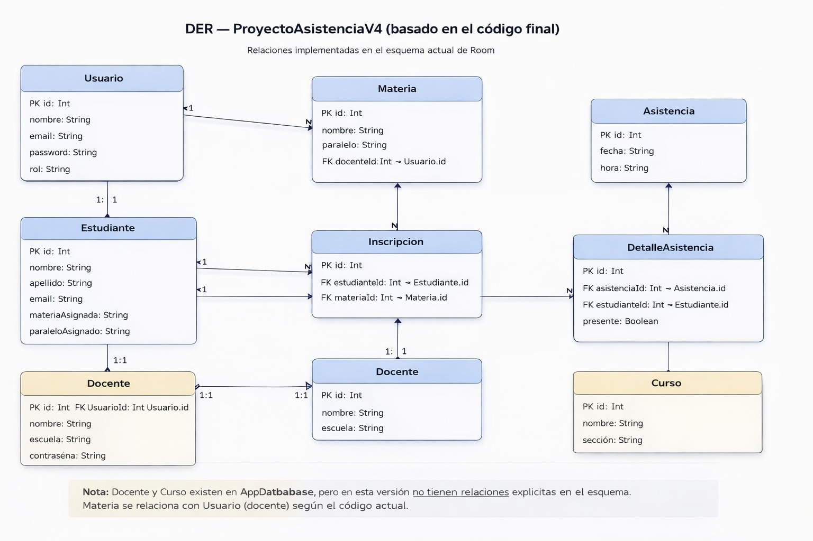
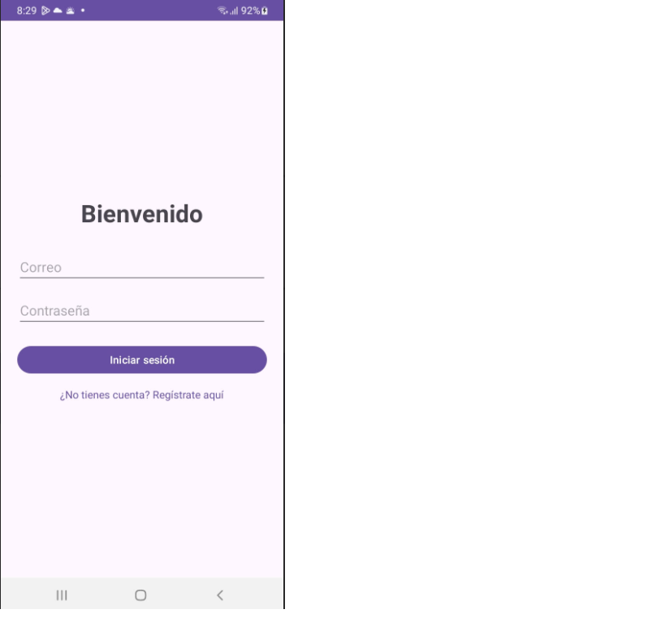
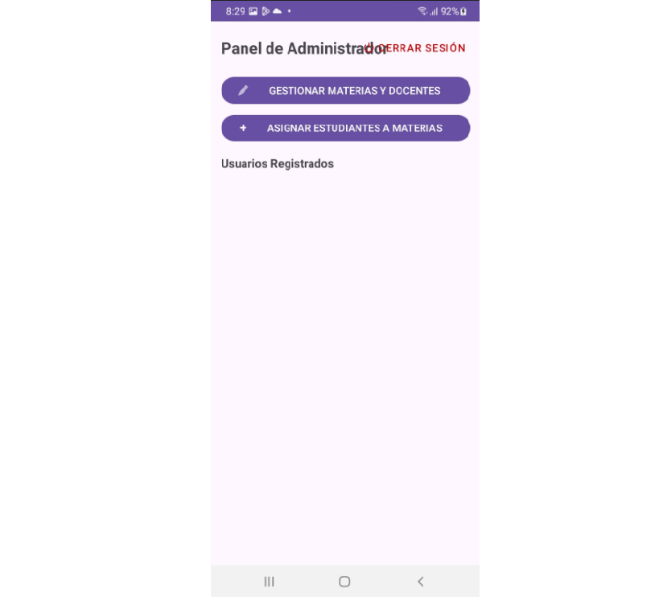
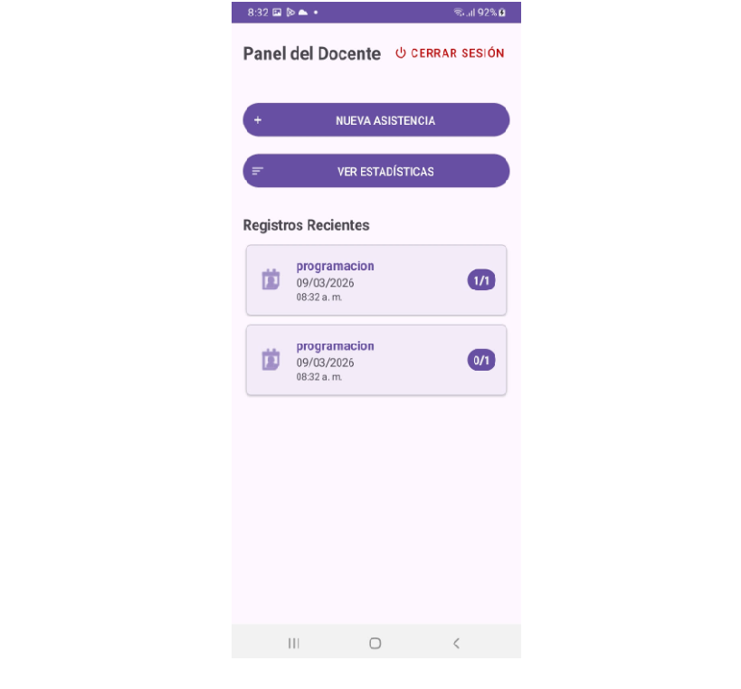
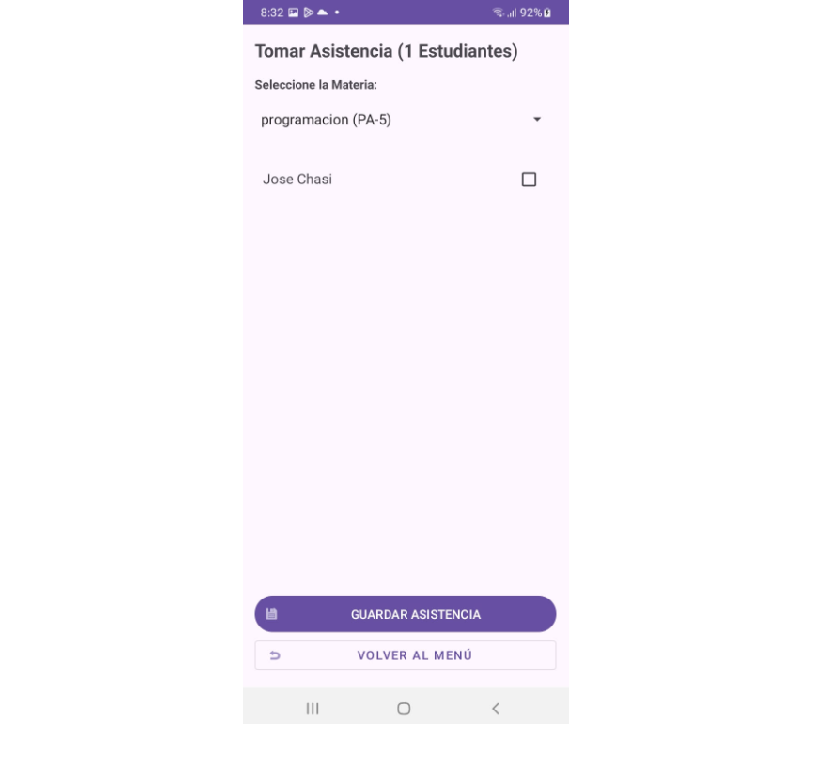
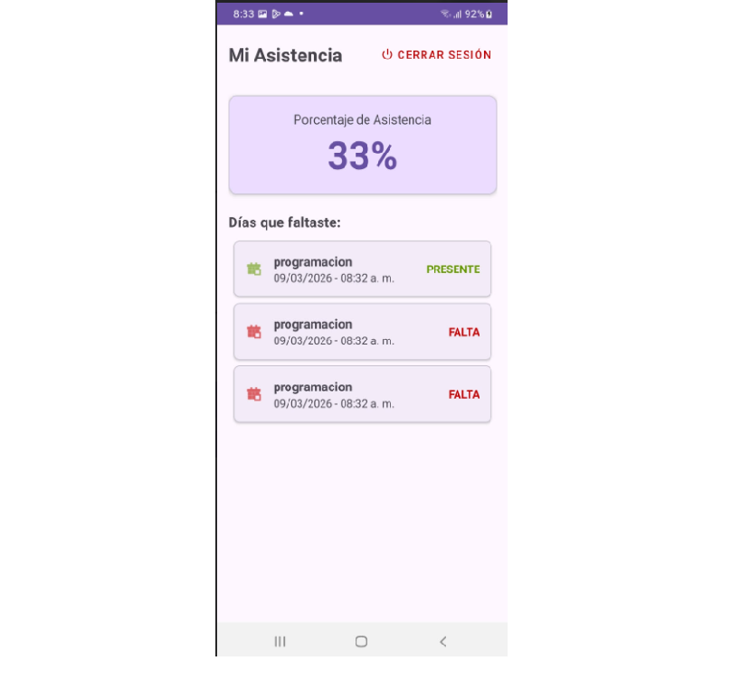

# Proyecto Final - Registro Académico y Asistencia

## Descripción del proyecto
Tema: Persistencia de datos local para la gestión de control académico. 
Título del Proyecto: Sistema Móvil de Gestión de Asistencia y Control Académico (RegistroAcademico)

El sistema permite manejar distintos roles dentro de la aplicación:
- **Administrador:** crea usuarios y asigna roles.
- **Docente:** crea materias/paralelos y registra la asistencia de los estudiantes inscritos.
- **Estudiante:** se inscribe en materias y consulta su información académica/asistencia.

La aplicación fue desarrollada aplicando arquitectura **MVVM**, persistencia local con **Room Database** y consumo de servicios externos mediante **Retrofit**.

---

## Tecnologías utilizadas
- Kotlin
- Android Studio
- Room Database
- Retrofit
- RecyclerView
- ViewBinding
- Material Design 3
- GitHub

---

## Funcionalidades principales
- Inicio de sesión por roles
- Gestión de usuarios
- Asignación de roles
- Creación de materias y paralelos
- Inscripción de estudiantes
- Registro de asistencia
- Visualización de asistencia
- Estadísticas básicas
- Persistencia local offline con Room
- Integración con API mediante Retrofit

---

## Arquitectura
El proyecto utiliza la arquitectura **MVVM (Model - View - ViewModel)** para separar la lógica de negocio, la persistencia de datos y la interfaz gráfica.

---

## Diagrama Entidad Relación (DER)
erDiagram
    %% Relaciones principales
    USUARIO ||--o{ MATERIA : "imparte (docenteId)"
    USUARIO ||--o| DOCENTE : "puede tener perfil de"

    MATERIA ||--o{ ASISTENCIA : "tiene registros de"
    MATERIA ||--o{ INSCRIPCION : "contiene"

    ESTUDIANTE ||--o{ INSCRIPCION : "esta inscrito en"
    ESTUDIANTE ||--o{ DETALLE_ASISTENCIA : "aparece en"

    ASISTENCIA ||--|{ DETALLE_ASISTENCIA : "se compone de"

    %% Tablas
    USUARIO {
        int id PK
        string nombre
        string email
        string password
        string rol "admin/docente/estudiante"
    }

    DOCENTE {
        int id PK
        int usuarioId FK "Usuario.id"
    }

    ESTUDIANTE {
        int id PK
        string nombre
        string apellido
        string email
    }

    MATERIA {
        int id PK
        string nombre
        string paralelo
        int docenteId FK "Usuario.id"
    }

    ASISTENCIA {
        int id PK
        string fecha
        string hora
        int materiaId FK "Materia.id"
    }

    DETALLE_ASISTENCIA {
        int id PK
        int asistenciaId FK "Asistencia.id"
        int estudianteId FK "Estudiante.id"
        boolean presente
    }

    INSCRIPCION {
        int id PK
        int estudianteId FK "Estudiante.id"
        int materiaId FK "Materia.id"
    }

---

## Capturas de pantalla

### Inicio de sesión

### Panel de administrador

### Panel de docente

### Registro de asistencia

### Estadísticas / resumen

---

## Integrantes
- Chasi José
- Chiriboga Maria José

---

## Repositorio
Proyecto desarrollado como parte del examen final de la materia de Aplicaciones Móviles.
